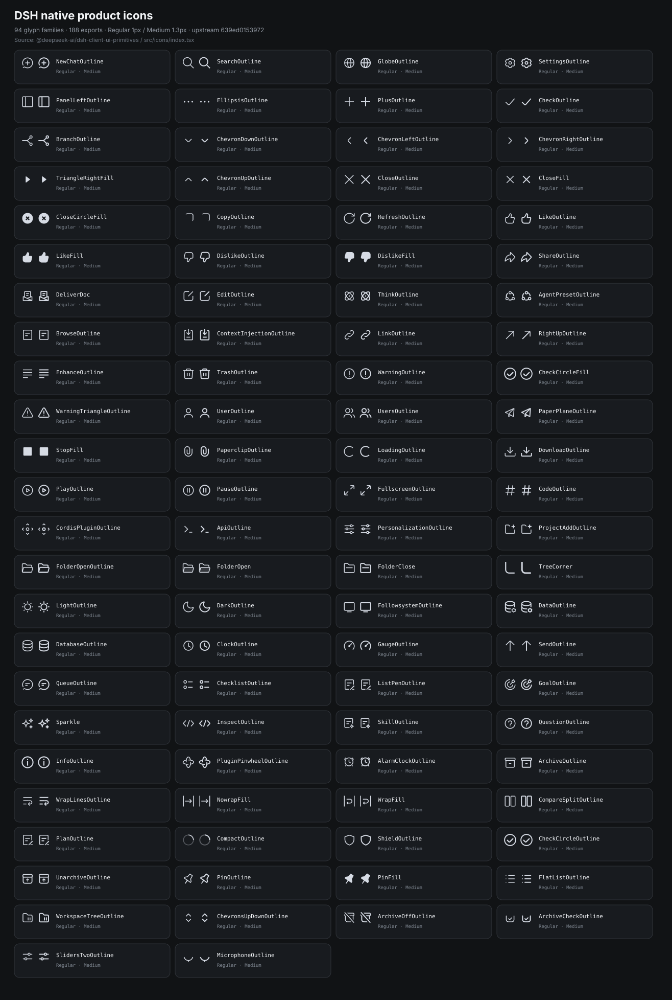

# DSH native icons

[← UI code reference](./README.md)

This page indexes the standard current-color product icon set exported by DSH `ui-primitives` at [`477b4f420553`](https://github.com/deepseek-ai/deepseek-harness/blob/477b4f420553e8a52c2fbccc464d7561b239c443/packages/client/ui-primitives/src/icons/index.tsx).

**94 glyph families / 188 named exports.** Every family normally has a Regular and Medium export. Regular uses a 1px stroke; Medium uses 1.3px where the geometry is stroke-based. Fill-only glyphs may render identically in both weights.



## Usage

```tsx
import {
  IconDownloadOutlineRegular,
  IconRefreshOutlineRegular,
  IconWarningOutlineRegular,
} from '@deepseek-ai/dsh-client-ui-primitives'

<IconDownloadOutlineRegular size={16} />
```

Use the component's `size` prop and let `currentColor` inherit from the surrounding control. Do not copy path data into feature code when an exported icon already exists.

## Semantic note: Refresh vs Update

`IconRefreshOutlineRegular` is the native circular single-arrow refresh/retry glyph. The pinned DSH icon set does not contain a dedicated package-update/sync glyph with two chasing circular arrows. Keep those meanings distinct in extension UI.

## Complete export index

| Glyph family | Regular | Medium |
|---|---|---|
| `NewChatOutline` | `IconNewChatOutlineRegular` | `IconNewChatOutlineMedium` |
| `SearchOutline` | `IconSearchOutlineRegular` | `IconSearchOutlineMedium` |
| `GlobeOutline` | `IconGlobeOutlineRegular` | `IconGlobeOutlineMedium` |
| `SettingsOutline` | `IconSettingsOutlineRegular` | `IconSettingsOutlineMedium` |
| `PanelLeftOutline` | `IconPanelLeftOutlineRegular` | `IconPanelLeftOutlineMedium` |
| `EllipsisOutline` | `IconEllipsisOutlineRegular` | `IconEllipsisOutlineMedium` |
| `PlusOutline` | `IconPlusOutlineRegular` | `IconPlusOutlineMedium` |
| `CheckOutline` | `IconCheckOutlineRegular` | `IconCheckOutlineMedium` |
| `BranchOutline` | `IconBranchOutlineRegular` | `IconBranchOutlineMedium` |
| `ChevronDownOutline` | `IconChevronDownOutlineRegular` | `IconChevronDownOutlineMedium` |
| `ChevronLeftOutline` | `IconChevronLeftOutlineRegular` | `IconChevronLeftOutlineMedium` |
| `ChevronRightOutline` | `IconChevronRightOutlineRegular` | `IconChevronRightOutlineMedium` |
| `TriangleRightFill` | `IconTriangleRightFillRegular` | `IconTriangleRightFillMedium` |
| `ChevronUpOutline` | `IconChevronUpOutlineRegular` | `IconChevronUpOutlineMedium` |
| `CloseOutline` | `IconCloseOutlineRegular` | `IconCloseOutlineMedium` |
| `CloseFill` | `IconCloseFillRegular` | `IconCloseFillMedium` |
| `CloseCircleFill` | `IconCloseCircleFillRegular` | `IconCloseCircleFillMedium` |
| `CopyOutline` | `IconCopyOutlineRegular` | `IconCopyOutlineMedium` |
| `RefreshOutline` | `IconRefreshOutlineRegular` | `IconRefreshOutlineMedium` |
| `LikeOutline` | `IconLikeOutlineRegular` | `IconLikeOutlineMedium` |
| `LikeFill` | `IconLikeFillRegular` | `IconLikeFillMedium` |
| `DislikeOutline` | `IconDislikeOutlineRegular` | `IconDislikeOutlineMedium` |
| `DislikeFill` | `IconDislikeFillRegular` | `IconDislikeFillMedium` |
| `ShareOutline` | `IconShareOutlineRegular` | `IconShareOutlineMedium` |
| `DeliverDoc` | `IconDeliverDocRegular` | `IconDeliverDocMedium` |
| `EditOutline` | `IconEditOutlineRegular` | `IconEditOutlineMedium` |
| `ThinkOutline` | `IconThinkOutlineRegular` | `IconThinkOutlineMedium` |
| `AgentPresetOutline` | `IconAgentPresetOutlineRegular` | `IconAgentPresetOutlineMedium` |
| `BrowseOutline` | `IconBrowseOutlineRegular` | `IconBrowseOutlineMedium` |
| `ContextInjectionOutline` | `IconContextInjectionOutlineRegular` | `IconContextInjectionOutlineMedium` |
| `LinkOutline` | `IconLinkOutlineRegular` | `IconLinkOutlineMedium` |
| `RightUpOutline` | `IconRightUpOutlineRegular` | `IconRightUpOutlineMedium` |
| `EnhanceOutline` | `IconEnhanceOutlineRegular` | `IconEnhanceOutlineMedium` |
| `TrashOutline` | `IconTrashOutlineRegular` | `IconTrashOutlineMedium` |
| `WarningOutline` | `IconWarningOutlineRegular` | `IconWarningOutlineMedium` |
| `CheckCircleFill` | `IconCheckCircleFillRegular` | `IconCheckCircleFillMedium` |
| `WarningTriangleOutline` | `IconWarningTriangleOutlineRegular` | `IconWarningTriangleOutlineMedium` |
| `UserOutline` | `IconUserOutlineRegular` | `IconUserOutlineMedium` |
| `UsersOutline` | `IconUsersOutlineRegular` | `IconUsersOutlineMedium` |
| `PaperPlaneOutline` | `IconPaperPlaneOutlineRegular` | `IconPaperPlaneOutlineMedium` |
| `StopFill` | `IconStopFillRegular` | `IconStopFillMedium` |
| `PaperclipOutline` | `IconPaperclipOutlineRegular` | `IconPaperclipOutlineMedium` |
| `LoadingOutline` | `IconLoadingOutlineRegular` | `IconLoadingOutlineMedium` |
| `DownloadOutline` | `IconDownloadOutlineRegular` | `IconDownloadOutlineMedium` |
| `PlayOutline` | `IconPlayOutlineRegular` | `IconPlayOutlineMedium` |
| `PauseOutline` | `IconPauseOutlineRegular` | `IconPauseOutlineMedium` |
| `FullscreenOutline` | `IconFullscreenOutlineRegular` | `IconFullscreenOutlineMedium` |
| `CodeOutline` | `IconCodeOutlineRegular` | `IconCodeOutlineMedium` |
| `CordisPluginOutline` | `IconCordisPluginOutlineRegular` | `IconCordisPluginOutlineMedium` |
| `ApiOutline` | `IconApiOutlineRegular` | `IconApiOutlineMedium` |
| `PersonalizationOutline` | `IconPersonalizationOutlineRegular` | `IconPersonalizationOutlineMedium` |
| `ProjectAddOutline` | `IconProjectAddOutlineRegular` | `IconProjectAddOutlineMedium` |
| `FolderOpenOutline` | `IconFolderOpenOutlineRegular` | `IconFolderOpenOutlineMedium` |
| `FolderOpen` | `IconFolderOpenRegular` | `IconFolderOpenMedium` |
| `FolderClose` | `IconFolderCloseRegular` | `IconFolderCloseMedium` |
| `TreeCorner` | `IconTreeCornerRegular` | `IconTreeCornerMedium` |
| `LightOutline` | `IconLightOutlineRegular` | `IconLightOutlineMedium` |
| `DarkOutline` | `IconDarkOutlineRegular` | `IconDarkOutlineMedium` |
| `FollowsystemOutline` | `IconFollowsystemOutlineRegular` | `IconFollowsystemOutlineMedium` |
| `DataOutline` | `IconDataOutlineRegular` | `IconDataOutlineMedium` |
| `DatabaseOutline` | `IconDatabaseOutlineRegular` | `IconDatabaseOutlineMedium` |
| `ClockOutline` | `IconClockOutlineRegular` | `IconClockOutlineMedium` |
| `GaugeOutline` | `IconGaugeOutlineRegular` | `IconGaugeOutlineMedium` |
| `SendOutline` | `IconSendOutlineRegular` | `IconSendOutlineMedium` |
| `QueueOutline` | `IconQueueOutlineRegular` | `IconQueueOutlineMedium` |
| `ChecklistOutline` | `IconChecklistOutlineRegular` | `IconChecklistOutlineMedium` |
| `ListPenOutline` | `IconListPenOutlineRegular` | `IconListPenOutlineMedium` |
| `GoalOutline` | `IconGoalOutlineRegular` | `IconGoalOutlineMedium` |
| `Sparkle` | `IconSparkleRegular` | `IconSparkleMedium` |
| `InspectOutline` | `IconInspectOutlineRegular` | `IconInspectOutlineMedium` |
| `SkillOutline` | `IconSkillOutlineRegular` | `IconSkillOutlineMedium` |
| `QuestionOutline` | `IconQuestionOutlineRegular` | `IconQuestionOutlineMedium` |
| `InfoOutline` | `IconInfoOutlineRegular` | `IconInfoOutlineMedium` |
| `PluginPinwheelOutline` | `IconPluginPinwheelOutlineRegular` | `IconPluginPinwheelOutlineMedium` |
| `AlarmClockOutline` | `IconAlarmClockOutlineRegular` | `IconAlarmClockOutlineMedium` |
| `ArchiveOutline` | `IconArchiveOutlineRegular` | `IconArchiveOutlineMedium` |
| `WrapLinesOutline` | `IconWrapLinesOutlineRegular` | `IconWrapLinesOutlineMedium` |
| `NowrapFill` | `IconNowrapFillRegular` | `IconNowrapFillMedium` |
| `WrapFill` | `IconWrapFillRegular` | `IconWrapFillMedium` |
| `CompareSplitOutline` | `IconCompareSplitOutlineRegular` | `IconCompareSplitOutlineMedium` |
| `PlanOutline` | `IconPlanOutlineRegular` | `IconPlanOutlineMedium` |
| `CompactOutline` | `IconCompactOutlineRegular` | `IconCompactOutlineMedium` |
| `ShieldOutline` | `IconShieldOutlineRegular` | `IconShieldOutlineMedium` |
| `CheckCircleOutline` | `IconCheckCircleOutlineRegular` | `IconCheckCircleOutlineMedium` |
| `UnarchiveOutline` | `IconUnarchiveOutlineRegular` | `IconUnarchiveOutlineMedium` |
| `PinOutline` | `IconPinOutlineRegular` | `IconPinOutlineMedium` |
| `PinFill` | `IconPinFillRegular` | `IconPinFillMedium` |
| `FlatListOutline` | `IconFlatListOutlineRegular` | `IconFlatListOutlineMedium` |
| `WorkspaceTreeOutline` | `IconWorkspaceTreeOutlineRegular` | `IconWorkspaceTreeOutlineMedium` |
| `ChevronsUpDownOutline` | `IconChevronsUpDownOutlineRegular` | `IconChevronsUpDownOutlineMedium` |
| `ArchiveOffOutline` | `IconArchiveOffOutlineRegular` | `IconArchiveOffOutlineMedium` |
| `ArchiveCheckOutline` | `IconArchiveCheckOutlineRegular` | `IconArchiveCheckOutlineMedium` |
| `SlidersTwoOutline` | `IconSlidersTwoOutlineRegular` | `IconSlidersTwoOutlineMedium` |
| `MicrophoneOutline` | `IconMicrophoneOutlineRegular` | `IconMicrophoneOutlineMedium` |

## Other icon-like primitives

These live in `ui-primitives` but are intentionally separate from the 188 standard `icons/*` exports:

- `PermissionIconReadOnlyRegular/Medium`
- `PermissionIconWorkspaceWriteRegular/Medium`
- `PermissionIconFullAccessRegular/Medium`
- `ReferenceIconRegular/Medium`
- `LinkIconRegular/Medium`
- `FileTypeIcon`
- `FishLogo`, `BrandWordmark`
- `PluginArtworkTerminal`, `PluginArtworkLoop`, `PluginArtworkSubagent`, `PluginArtworkSearch`, `PluginArtworkDefault`
- `GuideArtworkBrowser`, `GuideArtworkFiles`

See [Components](./COMPONENTS.md) for source links and intended families.
